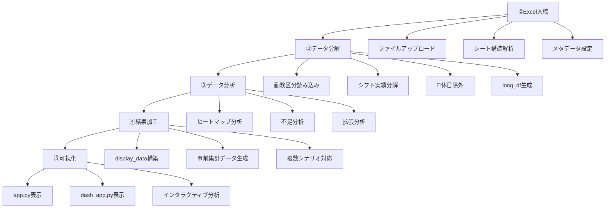

# シフト分析システム データフロー詳細分析

## 📋 概要
シフト分析システムの完全なデータフローを①入稿 → ②分解 → ③分析 → ④加工 → ⑤可視化の5段階に分けて詳細分析。

---

## ① データの入稿段階

### **📁 入力ファイル形式**
- **ファイル**: Excel (.xlsx)
- **構成**: 複数シート構造
  - **勤務区分シート**: 勤務コード定義（記号、開始時刻、終了時刻、備考）
  - **シフト実績シート**: 実際のシフト割り当て（スタッフ名 × 日付マトリクス）

### **🔄 入稿プロセス**

#### **A. ファイルアップロード** (`app.py`: 350-361行)
```python
uploaded = st.file_uploader("Excel file", type=["xlsx"])
# 一時ディレクトリに保存
tmp = tempfile.mkdtemp(prefix="ShiftSuiteWizard_")
path = Path(tmp) / uploaded.name
with open(path, "wb") as f:
    f.write(uploaded.getbuffer())
```

**処理内容**:
- Streamlitファイルアップローダーで受信
- 一時ディレクトリ（`ShiftSuiteWizard_*`）に保存
- ファイルサイズ・パス情報をセッションステートに格納

#### **B. シート構造解析** (`app.py`: 360-367行)
```python
xls = pd.ExcelFile(path)
st.session_state.wizard_sheet_names = xls.sheet_names
master = st.selectbox("勤務区分シート", st.session_state.wizard_sheet_names)
opts = [s for s in st.session_state.wizard_sheet_names if s != master]
```

**処理内容**:
- 全シート名を取得・解析
- ユーザーが勤務区分シートとシフト実績シートを選択
- シート選択情報をセッションに保存

#### **C. メタデータ設定** (`app.py`: 388-433行)
```python
ym = st.text_input("年月情報セル位置", value="A1")  # 例: "2025年6月"の位置
hdr = st.number_input("列名ヘッダー行番号", 1, 20, value=1)  # スタッフ名行
data_start = st.number_input("データ開始行番号", value=hdr + 1)  # 日付データ開始行
```

**処理内容**:
- **年月セル位置**: 「2025年6月」など期間情報の場所
- **ヘッダー行**: スタッフ名などの列名がある行番号
- **データ開始行**: 実際のシフトデータが始まる行番号
- プレビュー表示で設定確認

### **📊 入稿段階の出力**
```python
st.session_state.uploaded_files_info = {
    uploaded.name: {
        "path": "/tmp/ShiftSuiteWizard_xyz/ショート_テスト用データ.xlsx",
        "size": 12345
    }
}
st.session_state.shift_sheets_multiselect_widget = ["R7.6"]  # 選択されたシフトシート
st.session_state.year_month_cell_input_widget = "D1"  # 年月セル位置
st.session_state.header_row_input_widget = 1  # ヘッダー行番号
```

**データ状態**:
- Excelファイルが一時ディレクトリに保存済み
- シート構造・メタデータが解析済み
- ユーザー設定がセッションステートに格納済み
- 次段階（分解）の準備完了

---

## ② データの分解段階

### **🔧 分解エンジン**: `ingest_excel()` (`io_excel.py`: 329-699行)

#### **A. 勤務区分定義の読み込み** (`io_excel.py`: 343-293行)
```python
wt_df, code2slots = load_shift_patterns(excel_path, slot_minutes=slot_minutes)
```

**詳細処理**:
1. **勤務区分シート読み込み** (`io_excel.py`: 174-293行)
   - 記号（×、2F、3F、L、〇、夜、明など）
   - 開始・終了時刻（08:00-17:00など）
   - 備考（休暇種別など）

2. **休暇コード判定** (`io_excel.py`: 168-171行, 56-65行)
   ```python
   LEAVE_CODES = {
       "×": "希望休",
       "休": "施設休", 
       "有": "有給",
       "欠": "欠勤",
       # ... 他の休暇コード
   }
   ```

3. **時間スロット展開** (`io_excel.py`: 230-233行)
   ```python
   slots = _expand(st_hm, ed_hm, slot_minutes=slot_minutes)  # 08:00-17:00 → ['08:00', '08:30', '09:00', ...]
   ```

#### **B. シフト実績データの分解** (`io_excel.py`: 403-647行)

**入力形式**:
```
       氏名    | 2025/6/1 | 2025/6/2 | 2025/6/3 | ...
   田中太郎    |    2F    |    ×     |    3F    | ...
   佐藤花子    |    L     |    有    |    2F    | ...
```

**分解処理**:
1. **日付ヘッダー解析** (`io_excel.py`: 438-481行)
   - 列名から日付を抽出・正規化
   - 年月情報との統合
   
2. **スタッフ×日付×勤務コードの3次元分解** (`io_excel.py`: 482-647行)
   ```python
   for staff in スタッフリスト:
       for date_col in 日付列:
           code_val = df.loc[staff, date_col]  # 例: "2F"
           if code_val in code2slots:
               slots = code2slots[code_val]  # ['08:00', '08:30', ..., '16:30']
               for slot_time in slots:
                   records.append({
                       "ds": datetime(2025, 6, 1, 8, 0),  # 日付+時刻
                       "staff": "田中太郎",
                       "role": "看護師",
                       "employment": "常勤",
                       "code": "2F",
                       "holiday_type": "通常勤務",
                       "parsed_slots_count": 17  # スロット数
                   })
   ```

#### **🎯 休日除外処理** (`io_excel.py`: 647-699行)
```python
# 1. parsed_slots_count <= 0 のレコード除外（「×」など）
rest_day_mask = final_long_df['parsed_slots_count'] <= 0
final_long_df = final_long_df[~rest_day_mask]

# 2. holiday_type != '通常勤務' のレコード除外
non_working_mask = final_long_df['holiday_type'] != DEFAULT_HOLIDAY_TYPE
final_long_df = final_long_df[~non_working_mask]

# 3. スタッフ名に休み記号が含まれるレコード除外
rest_symbols = ['×', 'X', 'x', '休', 'OFF', 'off', '-', '', '欠', '有']
# ... 除外処理
```

### **📊 分解段階の出力**

#### **A. long_df (長形式データフレーム)**
```python
        ds           staff    role    employment  code  holiday_type  parsed_slots_count
0  2025-06-01 08:00  田中太郎  看護師      常勤     2F      通常勤務              17
1  2025-06-01 08:30  田中太郎  看護師      常勤     2F      通常勤務              17
2  2025-06-01 09:00  田中太郎  看護師      常勤     2F      通常勤務              17
...
```

**特徴**:
- **1レコード = 1スタッフ × 1時間スロット × 1勤務**
- **休日データが完全除外済み**
- **時系列データとして後続処理で使用可能**

#### **B. wt_df (勤務区分定義データフレーム)**
```python
  code  start_parsed  end_parsed  parsed_slots_count  holiday_type  is_leave_code
0   2F         08:00       17:00                  17      通常勤務          False
1    ×          None        None                   0        希望休           True
2   有          None        None                   0        有給休          True
```

#### **C. unknown_codes (未知勤務コード集合)**
```python
{"謎コード", "不明記号"}  # 勤務区分シートに定義されていないコード
```

---

## ③ データ分析段階

### **🎯 分析エンジン**: 複数モジュールによる並列処理

#### **A. ヒートマップ分析** (`heatmap.py`: 424-800行)
**入力**: `long_df` (休日除外済み)

**処理フロー**:
1. **Need値計算** (`heatmap.py`: 600-700行)
   ```python
   # 統計的Need計算（中央値、平均値、25パーセンタイル）
   need_calculator = NeedCalculator(method="中央値")
   need_per_timeslot = need_calculator.calculate(long_df)
   ```

2. **スタッフカウント集計** (`heatmap.py`: 720-750行)
   ```python
   # 時間スロット × 日付 での人数集計
   staff_count_pivot = long_df.groupby(['time', 'date']).size().unstack(fill_value=0)
   ```

3. **職種別・雇用形態別分析**
   ```python
   # 職種別ヒートマップ
   for role in ["看護師", "介護士", "事務"]:
       role_df = long_df[long_df['role'] == role]
       role_heatmap = create_heatmap(role_df)
       save_parquet(f"heat_{role}.parquet")
   ```

**出力**:
- `heat_ALL.parquet`: 全体ヒートマップ
- `heat_看護師.parquet`: 職種別ヒートマップ
- `heat_常勤.parquet`: 雇用形態別ヒートマップ
- `need_per_date_slot.parquet`: 日付×時間スロット別Need値

#### **B. 不足分析** (`shortage.py`: 27-200行)
**入力**: `heat_ALL.parquet` (休日除外済みデータから生成)

**処理フロー**:
1. **時間軸ベース不足計算** (`shortage.py`: 76-120行)
   ```python
   # 実際の配置人数 vs Need値の差分計算
   shortage_time = pd.DataFrame({
       'time': time_labels,
       'lack_h': (need_per_slot - actual_per_slot).clip(lower=0) * slot_hours,
       'excess_h': (actual_per_slot - need_per_slot).clip(lower=0) * slot_hours
   })
   ```

2. **職種別・雇用形態別不足分析**
   ```python
   shortage_role = calculate_role_shortage(heat_ALL_df, need_data)
   shortage_employment = calculate_employment_shortage(heat_ALL_df, need_data)
   ```

**出力**:
- `shortage_time.parquet`: 時間別不足・余剰時間
- `shortage_role.parquet`: 職種別不足分析
- `shortage_employment.parquet`: 雇用形態別不足分析

#### **C. 拡張分析** (オプション)
- **公平性分析**: `fairness.py`
- **疲労度分析**: `fatigue.py`
- **休暇分析**: `leave_analyzer.py`
- **クラスター分析**: `cluster.py`

---

## ④ 分析結果の加工段階

### **🔧 加工エンジン**: 表示用データ変換

#### **A. display_data構築** (`app.py`: 1699-1800行)
```python
# 全日付・時間帯・職種・雇用形態の組み合わせを網羅するベースデータ作成
base_combinations = create_all_combinations(
    dates=all_dates_in_period,
    time_slots=time_labels, 
    roles=available_roles,
    employments=available_employments
)
```

**処理内容**:
1. **マスターデータ作成**
   - 全期間の日付リスト
   - 全時間スロットリスト  
   - 全職種リスト
   - 全雇用形態リスト

2. **実績データとの結合**
   ```python
   display_data = base_combinations.merge(
       actual_staff_data, 
       on=['date', 'time', 'role', 'employment'], 
       how='left'
   ).fillna(0)
   ```

3. **集計レベル生成**
   ```python
   # 時間帯別サマリー
   time_summary = display_data.groupby('time').agg({
       'staff_count': 'sum',
       'need_count': 'sum', 
       'lack_h': 'sum',
       'excess_h': 'sum'
   })
   
   # 職種別サマリー  
   role_summary = display_data.groupby('role').agg(...)
   ```

#### **B. 事前集計データ生成** (`app.py`: 1615-1620行)
```python
# dash_app.py用の事前集計データ
shutil.copy(intermediate_parquet_path, scenario_out_dir / "intermediate_data.parquet")
shutil.copy(work_root_exec / "work_patterns.parquet", scenario_out_dir / "work_patterns.parquet")
```

**ファイル構成**:
```
out/
├── out_median_based/          # 中央値ベース分析結果
│   ├── heat_ALL.parquet
│   ├── shortage_time.parquet
│   ├── shortage_role.parquet
│   └── intermediate_data.parquet
├── out_mean_based/            # 平均値ベース分析結果  
└── out_p25_based/            # 25パーセンタイルベース分析結果
```

---

## ⑤ 可視化段階

### **📊 可視化エンジン**: 2つの表示システム

#### **A. app.py での可視化** (メイン画面)

**1. 結果サマリー表示** (`app.py`: 1850-1950行)
```python
# 分析結果の統計表示
st.metric("総不足時間", f"{total_lack_hours:.1f}時間")
st.metric("総余剰時間", f"{total_excess_hours:.1f}時間") 
st.metric("分析期間", f"{analysis_start} - {analysis_end}")
```

**2. ヒートマップ表示** (`app.py`: 770-850行)
```python
def generate_heatmap_figure(df_heat, mode, scope_info):
    fig = px.imshow(
        df_heat,
        aspect='auto',
        color_continuous_scale='Viridis',
        title=f"{mode}ヒートマップ - {scope_info}",
        labels={'x': '日付', 'y': '時間', 'color': '人数'}
    )
    return fig
```

**3. 統計チャート** (`app.py`: 2000-2100行)
```python
# 職種別不足時間棒グラフ
fig_role = px.bar(
    shortage_role_df, 
    x='role', 
    y='lack_h',
    title='職種別不足時間'
)

# 雇用形態別円グラフ  
fig_emp = px.pie(
    shortage_emp_df,
    values='lack_h', 
    names='employment',
    title='雇用形態別不足割合'
)
```

#### **B. dash_app.py での可視化** (詳細ダッシュボード)

**1. データ読み込み** (`dash_app.py`: 792-943行)
```python
def data_get(key: str, default=None):
    # キャッシュチェック
    cached_value = DATA_CACHE.get(key)
    if cached_value is not None:
        return cached_value
    
    # ファイル検索・読み込み
    for directory in search_dirs:
        fp = directory / f"{key}.parquet"
        if fp.exists():
            df = safe_read_parquet(fp)
            # 🎯 休日除外フィルター適用
            if key in ['pre_aggregated_data', 'long_df', 'intermediate_data']:
                df = create_enhanced_rest_exclusion_filter(df)
            DATA_CACHE.set(key, df)
            return df
```

**2. 動的ヒートマップ生成** (`dash_app.py`: 3750-3870行)
```python
def update_comparison_heatmaps(role1, emp1, role2, emp2):
    aggregated_df = data_get('pre_aggregated_data')
    
    # 選択条件でフィルタリング
    if selected_role and selected_role != 'all':
        filtered_df = filtered_df[filtered_df['role'] == selected_role]
    
    # ピボット化してヒートマップ作成
    heatmap_df = filtered_df.pivot_table(
        index='time',
        columns='date_lbl', 
        values='staff_count',
        aggfunc='sum',
        fill_value=0
    )
    
    fig = generate_heatmap_figure(heatmap_df, title)
    return dcc.Graph(figure=fig)
```

**3. インタラクティブ分析**
- **職種・雇用形態フィルタリング**
- **日付範囲選択**
- **リアルタイム更新**
- **詳細統計表示**

### **🎯 可視化の特徴**

#### **休日除外の可視化確認**
1. **ヒートマップ**: 休日（土日、「×」記号）の時間帯に数値が表示されない
2. **統計グラフ**: 実際の勤務データのみで計算された正確な値
3. **ログ表示**: `[RestExclusion]`メッセージでフィルタリング状況確認

#### **多角度分析表示**
1. **時間軸分析**: 時間帯別の人員配置状況
2. **職種別分析**: 看護師、介護士、事務などの職種別状況  
3. **雇用形態別分析**: 常勤、パート、スポットの配置バランス
4. **期間分析**: 日別、週別、月別のトレンド

---

## 📊 完全データフロー図



---

## 🔍 重要なデータ変換ポイント

### **①→②: マトリクス形式から時系列形式への変換**
```
入力: スタッフ×日付マトリクス → 出力: 時系列long_df
田中 | 2F  | ×  | 3F     →     ds          staff  code
佐藤 | L   | 有 | 2F     →     2025-06-01  田中   2F
                        →     2025-06-03  田中   3F  
                        →     2025-06-01  佐藤   L
                        →     2025-06-03  佐藤   2F
```

### **②→③: 時系列データから集計データへの変換**
```
long_df → heat_ALL.parquet, shortage_*.parquet
時間スロット単位データ → 日付×時間マトリクス
個人レベルデータ → 職種・雇用形態別集計データ
```

### **③→④: 分析結果から表示用データへの変換**
```
複数parquetファイル → 統合display_data
稀なデータポイント → 全組み合わせ網羅データ  
分析特化データ → UI表示最適化データ
```

### **④→⑤: 表示用データから可視化への変換**
```
display_data → インタラクティブ可視化
数値データ → グラフ・チャート・ヒートマップ
静的結果 → 動的フィルタリング・ドリルダウン
```

この詳細なデータフロー分析により、休日除外が各段階でどのように機能し、最終的な可視化にどう反映されるかが明確になります。