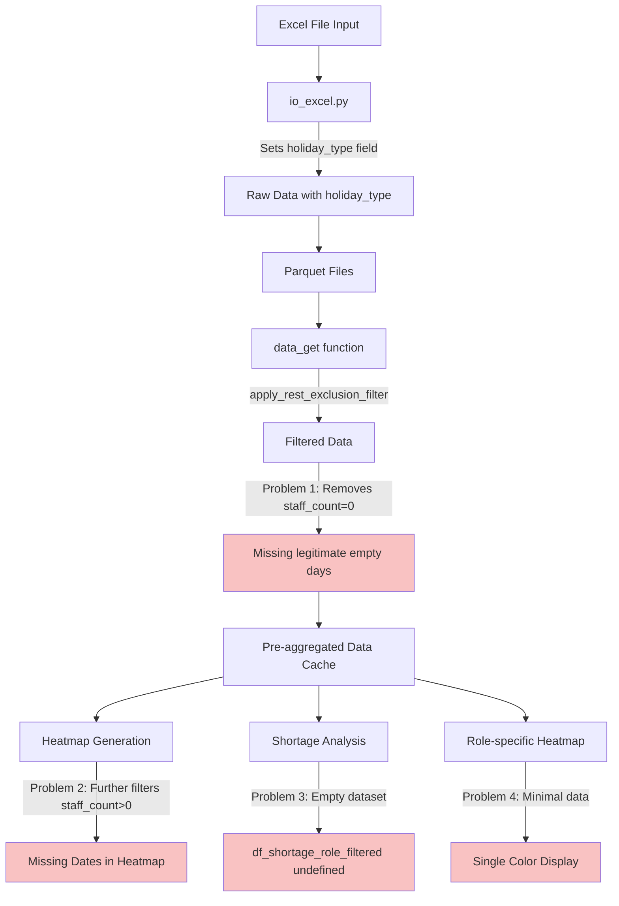
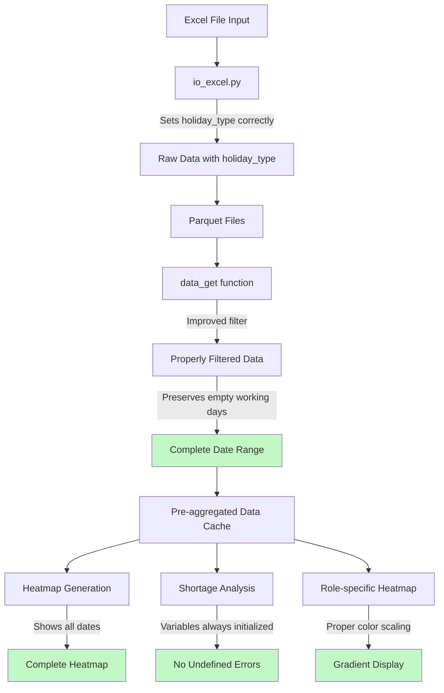

# Data Flow Diagram: シフト分析システム

## Current Data Flow (With Problems)



## Filtering Logic Breakdown

### Current Filter (Too Aggressive)
```
apply_rest_exclusion_filter removes:
├── Staff name patterns (×, 休, etc.) ✓ Correct
├── holiday_type != "通常勤務" ✓ Correct
├── staff_count <= 0 ✗ PROBLEM - Removes valid empty days
└── parsed_slots_count <= 0 ✓ Correct
```

### Result Categories

| Date Type | holiday_type | staff_count | Current | Should Be |
|-----------|--------------|-------------|---------|-----------|
| Holiday | "有給" | 0 | Removed ✓ | Removed ✓ |
| Holiday | "希望休" | 0 | Removed ✓ | Removed ✓ |
| Empty Working Day | "通常勤務" | 0 | Removed ✗ | Keep ✓ |
| Staffed Day | "通常勤務" | >0 | Keep ✓ | Keep ✓ |

## Fixed Data Flow



## Key Decision Points

### 1. Data Ingestion (io_excel.py)
✓ **Working correctly** - Sets holiday_type field properly
- "通常勤務" = Regular working day
- Other values = Various types of leave/holiday

### 2. Data Loading (data_get in dash_app.py)
✗ **Problem Point** - apply_rest_exclusion_filter too aggressive
- Should filter based on holiday_type, not staff_count

### 3. Heatmap Generation (generate_dynamic_heatmap)
✗ **Problem Point** - Secondary filtering removes more dates
- Should use all dates from period, not just staff_count > 0

### 4. Variable Initialization (create_shortage_analysis_content)
✗ **Problem Point** - Conditional initialization
- Should always initialize variables before conditions

## Visual Impact of Problems

### Before Fix (Current State)
```
Heatmap for March 2024:
Mon Tue Wed Thu Fri Sat Sun
                1   -   -   <- Weekend removed ✓
4   5   6   -   8   -   -   <- Thu 7th missing (empty day) ✗
11  -   13  14  15  -   -   <- Tue 12th missing (empty day) ✗
```

### After Fix (Desired State)
```
Heatmap for March 2024:
Mon Tue Wed Thu Fri Sat Sun
                1   -   -   <- Weekend removed ✓
4   5   6   7   8   -   -   <- All weekdays shown ✓
11  12  13  14  15  -   -   <- All weekdays shown ✓
```

Where:
- `-` = Holiday/Weekend (correctly filtered)
- `0` = Working day with no staff (should be visible)
- `>0` = Working day with staff

---
Created: 2025-07-23