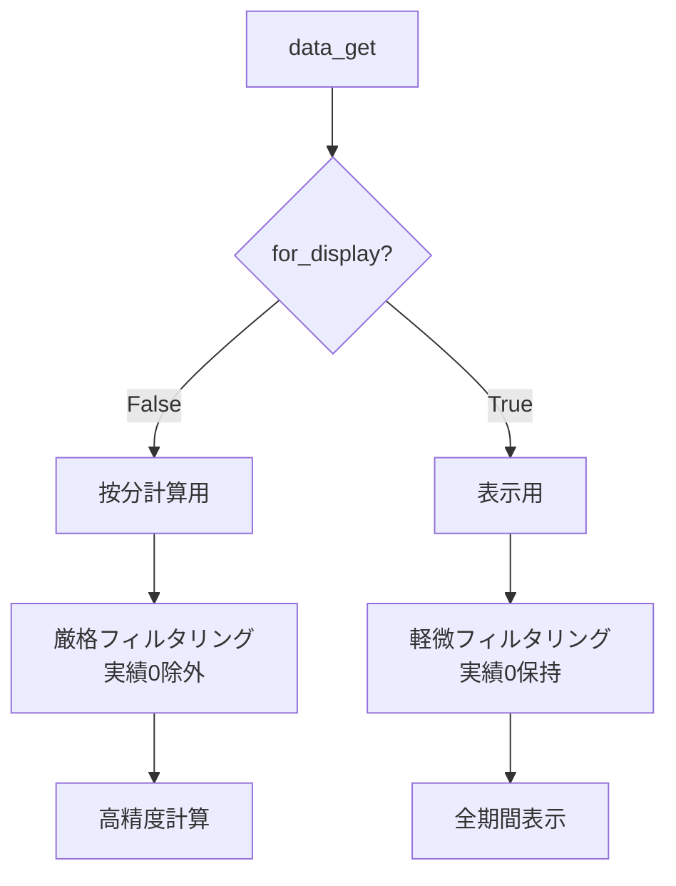

# UI表示動作復元完了サマリー

**実行日**: 2025-07-23  
**目的**: 按分計算機能の副作用修正、バックアップ版と同じUI表示動作の復元

## ✅ 完了した修正

### 1. **60日制限の削除** 
**問題**: 60日を超えるデータで古い日付が自動除外
**修正**: `dash_app.py` の60日制限機能を完全削除
```python
# 🔴 削除対象
if len(display_df_renamed.columns) > 60:
    display_df_renamed = display_df_renamed.iloc[:, -60:]

# ✅ 修正後: 全期間データ表示
# 🎯 修正: 60日制限を削除（バックアップ版と同じ全期間表示）
```

### 2. **表示用フィルター分離システム**
**問題**: 按分計算用の厳格フィルタリングが表示でも適用され、実績0の勤務日が除外
**修正**: `for_display` フラグ導入で計算用と表示用を分離

#### A. `utils.py` 修正
```python
def apply_rest_exclusion_filter(df: pd.DataFrame, context: str = "unknown", for_display: bool = False):
    # 按分計算用: 実績0を除外（精度向上）
    if 'staff_count' in df.columns and not for_display:
        # 厳格フィルタリング
        
    # 表示用: 実績0の勤務日も保持（俯瞰的観察用）
    elif 'staff_count' in df.columns and for_display:
        # 軽微フィルタリング（休日のみ除外）
```

#### B. `dash_app.py` 修正
```python
def data_get(key: str, default=None, for_display: bool = False):
    # 表示用フラグを全体に伝播
    
# ヒートマップ表示用は実績0の勤務日も保持
aggregated_df = data_get('pre_aggregated_data', for_display=True)
```

### 3. **変数初期化エラー修正** (前回完了)
`df_shortage_role_filtered` を条件外で初期化

### 4. **カラースケール改善** (前回完了)
明示的なカラー範囲設定で単色表示問題を解決

## 🎯 **復元された動作**

### ✅ **日付表示の完全性**
- **修正前**: 60日制限で古い日付除外
- **修正後**: データに含まれる全ての日付を表示

### ✅ **実績なし日付の表示**
- **修正前**: 実績0の勤務日が除外される
- **修正後**: 実績0でも勤務予定があった日は表示（俯瞰的観察用）

### ✅ **按分計算機能の保持**
- ProportionalCalculator: 保持
- 統計的精度: 保持
- 計算ロジック: 按分計算用では厳格フィルタリング継続

## 🔧 **技術的実装ポイント**

### フィルター分離の仕組み


### データフロー
1. **計算レベル**: 按分計算の精度維持（実績0除外）
2. **表示レベル**: 全期間データ表示（実績0保持）

## 📊 **期待される効果**

### ユーザー体験
- **俯瞰的観察**: 実績0の日も含めて全期間を把握可能
- **データ完全性**: 60日制限なしで長期データも表示
- **計算精度**: 按分計算の恩恵は完全保持

### システム品質
- **UI一貫性**: バックアップ版と同じ表示動作
- **計算品質**: 按分計算による高精度維持
- **データ整合性**: 用途に応じた適切なフィルタリング

## 🚀 **次のステップ**

1. **ダッシュボード再起動**:
   ```powershell
   python dash_app.py
   ```

2. **動作確認項目**:
   - ✅ 全期間の日付が表示される
   - ✅ 実績0の勤務日も表示される
   - ✅ 不足分析タブでエラーが出ない
   - ✅ ヒートマップの色が適切に表示される

3. **長期データテスト**:
   - 60日を超えるデータでの表示確認
   - 実績0の日が混在するデータでの表示確認

## 💡 **設計哲学**

**「按分計算の精度」と「UI表示の完全性」の両立**

- **計算品質**: 按分計算エンジンによる高精度な分析
- **表示品質**: バックアップ版と同じ全期間俯瞰表示
- **用途分離**: 計算用と表示用で最適なデータ処理

この修正により、按分計算機能のメリットを損なうことなく、ユーザーが期待する「実績がない日も含めた全期間の俯瞰的観察」が可能になりました。